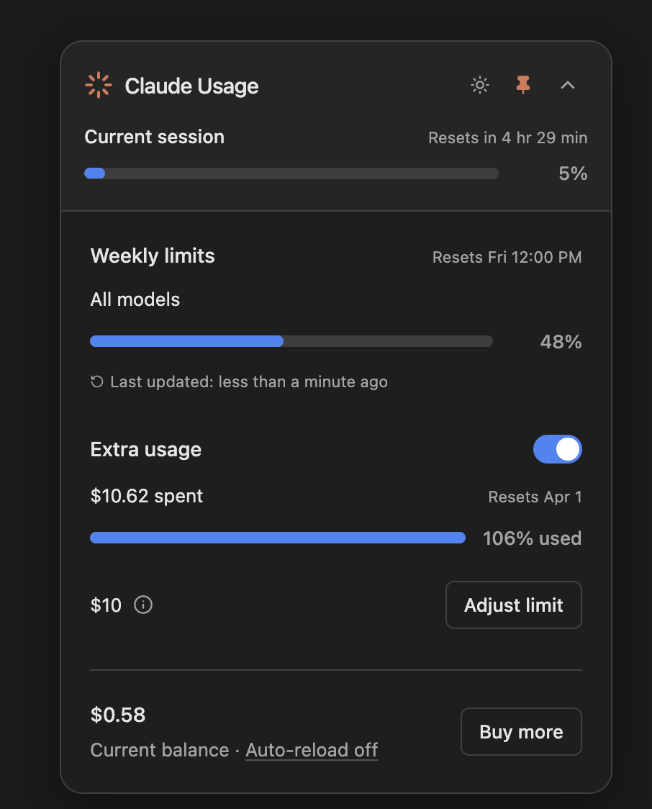

# Claude Usage Widget

A minimal macOS menu-bar widget for monitoring your Anthropic and Claude usage: session limits, weekly quota, extra spend, and account balance. Always-on-top, collapsible, and live-updating.



---

## Requirements

- macOS 12 or later
- Node.js 18 or later (for building from source)
- An Anthropic API key, or a signed-in `claude.ai` session in Chrome

---

## Quick Start

```bash
git clone https://github.com/takeemowens/claude-session-monitor
cd claude-session-monitor
npm install
cp usage_config.example.json usage_config.json
npm start
```

On first launch you can authenticate two ways:

1. **Anthropic API key.** Paste your key when prompted. It is validated once, then stored encrypted on your machine at `~/.claude-widget/auth.json`. It is never transmitted anywhere except `api.anthropic.com`, and never committed to this repo.
2. **Sign in with Claude.ai.** Use the in-app login window, or import your existing session from Chrome. See [SECURITY.md](SECURITY.md) for exactly what the Chrome import reads.

---

## Updating Usage Data

Edit `usage_config.json` in the project root. The widget watches the file and updates live, with no restart needed.

```json
{
  "session": { "used_percent": 68, "resets_in_hours": 3, "resets_in_minutes": 24 },
  "weekly":  { "used_percent": 42, "reset_day": "Fri", "reset_time": "12:00 PM" },
  "extra_usage": { "total_spent": 10.62, "monthly_limit": 10.00 },
  "balance": { "current": 0.58, "auto_reload": false, "reload_amount": 10.00, "reload_threshold": 5.00 },
  "last_updated": "2026-03-21T20:00:00Z"
}
```

---

## Build for Distribution

Build a universal `.dmg` (Apple Silicon and Intel):

```bash
npm install
npm run build:universal
```

Output lands in `dist/`.

**Important:** an unsigned build cannot be verified by macOS Gatekeeper, and a downloaded unsigned binary cannot be proven to be untampered. Do not distribute an unsigned `.dmg` to other people. For public distribution, sign and notarize with your own Apple Developer ID:

```bash
export CSC_LINK="path/to/cert.p12"
export CSC_KEY_PASSWORD="your-cert-password"
export APPLE_ID="your@apple.id"
export APPLE_APP_SPECIFIC_PASSWORD="xxxx-xxxx-xxxx-xxxx"
npm run build:universal
```

For your own machine or trusted testers, an unsigned build is fine: right-click the app and choose Open to bypass Gatekeeper on first launch.

---

## Security

The short version: nothing you provide leaves your machine except calls to Anthropic's own API.

- **API key** is encrypted via Electron `safeStorage` (OS keychain-backed), stored at `~/.claude-widget/auth.json` with owner-only permissions, outside the project directory.
- **Renderer isolation:** every window runs `contextIsolation: true`, `nodeIntegration: false`, and `sandbox: true`, exposing only a narrow `contextBridge` API.
- **External URLs:** `shell.openExternal` is allowlisted to `anthropic.com` and `console.anthropic.com` over HTTPS only.
- **Outbound requests:** limited to `api.anthropic.com` and, if you use the browser sign-in, `claude.ai`. No telemetry, analytics, or author-operated servers.
- **Chrome cookie import** is optional and reads only the `claude.ai` `sessionKey` cookie, locally, and only if you choose it.

Full disclosure of every local access and how to report an issue is in [SECURITY.md](SECURITY.md).

---

## License

[MIT](LICENSE). Provided as is, without warranty. You are free to use, modify, and distribute it, including commercially.
