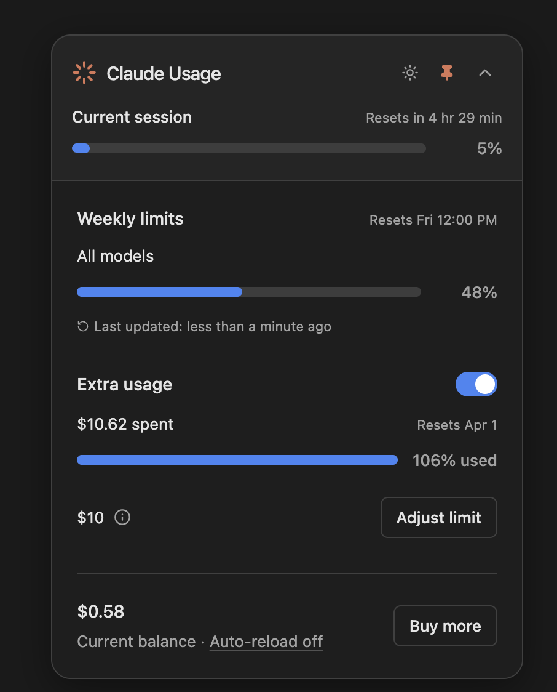

# Claude Usage Monitor

A minimal macOS menu bar widget for watching your Claude usage: the 5-hour session limit and the 7-day weekly quota, live, with a ring in the menu bar that fills as you go. Click the ring to open the panel. No API key, no account setup: it reads the claude.ai session you are already signed in to.



---

## Requirements

- macOS 12 or later, Apple Silicon
- Google Chrome signed in to claude.ai (the widget reads one cookie from it, once, locally)
- Node.js 18 or later, only if building from source

---

## Quick Start

```bash
git clone https://github.com/takeemowens/claude-session-monitor
cd claude-session-monitor
npm install
cp usage_config.example.json usage_config.json
npm start
```

On first launch the widget looks for an existing claude.ai session in Chrome and connects on its own. If it cannot, it shows a single Connect button that does the same thing on demand.

Signing out from the panel removes the stored session and returns you to that screen.

---

## What it shows

- **Current session**: percentage of the rolling 5-hour window used, and when it resets
- **Weekly, all models**: percentage of the 7-day quota used, and when it resets
- **Menu bar ring**: green under 80%, amber from 80, red from 90, with the number inside
- **Active sessions** in the ring's tooltip: how many Claude Code sessions are running on this Mac right now
- A notification when usage climbs unusually fast, and at the 80, 90 and 100 marks

Extra usage and balance appear only when your account has extra usage enabled, since there is no free source for them otherwise.

The timestamp in the footer turns clay when the data is more than five minutes old.

---

## Build

```bash
npm install
npm run build:arm64
```

Output is `dist/Claude Usage Monitor-<version>-arm64-mac.zip`. Unzip, move the `.app` to `/Applications`, open it.

`build:universal` exists but requires a working system Python for the universal binary step and is not the default.

**Important:** an unsigned build cannot be verified by macOS Gatekeeper, and a downloaded unsigned binary cannot be proven to be untampered. Do not distribute an unsigned build to other people. For public distribution, sign and notarize with your own Apple Developer ID:

```bash
export CSC_LINK="path/to/cert.p12"
export CSC_KEY_PASSWORD="your-cert-password"
export APPLE_ID="your@apple.id"
export APPLE_APP_SPECIFIC_PASSWORD="xxxx-xxxx-xxxx-xxxx"
npm run build:arm64
```

For your own machine or trusted testers, an unsigned build is fine: right-click the app and choose Open to bypass Gatekeeper on first launch.

---

## Security

The short version: nothing leaves your machine except requests to `claude.ai`.

- **Chrome import** reads exactly one cookie, the `claude.ai` `sessionKey`, from Chrome's local cookie store. Nothing else in that store is read.
- **Outbound requests** go only to `claude.ai`. No telemetry, analytics, or author-operated servers.
- **Renderer isolation:** every window runs `contextIsolation: true`, `nodeIntegration: false`, and `sandbox: true`, exposing only a narrow `contextBridge` API.
- **Local files** under `~/.claude-widget/` are written with owner-only permissions.
- **No Dock icon:** the app declares `LSUIElement` and lives in the menu bar only. Quit from the ring's right-click menu.

Full disclosure of every local access and how to report an issue is in [SECURITY.md](SECURITY.md).

---

## License

[MIT](LICENSE). Provided as is, without warranty. You are free to use, modify, and distribute it, including commercially.
